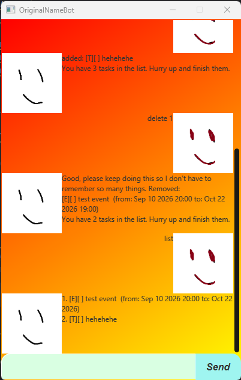

# OriginalNameBot User Guide



Introducing OriginalNameBot, a task manager. You can:
- Add todos/events/deadlines
- Mark them as done/undone
- Delete them

## Starting the application

It is advised to put the `.jar` file into a new folder with nothing inside, before proceeding. This will prevent any conflicts with directory names and potential unwanted changes to your existing files.


Navigate to the directory where `originalnamebot.jar` exists. Run this line to launch the app:
```
java -jar "originalnamebot.jar"
```


## Saving and Loading

The application allows for saving and loading of tasks in `./data/tasks.txt`

Upon opening the application, if a save file and its directory is detected, the tasks saved in that file will be loaded. Otherwise, the directory and the file will be automatically created.

The folder structure is as shown:
```
folder/
├─ data/
│  ├─ tasks.txt
├─ originalnamebot.jar
```

## Common Terms

- A Task refers to todos, deadlines, and events.
- A Date Item refers to either a Date or a DateTime. When a Date Item is mentioned, whether it is a Date or a DateTime does not matter as both are supported.
  - Date: YYYY-MM-DD (Example: `2026-02-16`)
  - DateTime: YYYY-MM-DD HHmm (Example: `2026-02-16 1900`)
  - Provide the times in 24-Hour format.

## Introduction and Common Terms

- Each Task will appear in the Graphical User Interface (GUI) in the following format:
```
- 1. [ ][ ] ....
- 2. [ ][ ] ....
```

- The number on the left of the task represents the Task Number.
- The leftmost `[ ]` will appear as either a `[T]`, `[D]` or `[E]` depending on what type of Task it is (T for todo, D for deadline and E for event)
- The rightmost `[ ]` will appear as either a `[ ]` or `[X]` depending on if the Task is done. `[X]` indicates that the Task is done.
- The ellipses `....` are placeholders for the Task description, deadlines, start and end times (if any)
- To manage tasks, enter a command in the textbox at the bottom of the GUI, and press the `Send` button or hit `Enter` on your keyboard. The following section details all the commands needed to use the application.

# Commands

All valid commands are shown below (case-sensitive)
- `mark`
- `unmark`
- `delete`
- `find`
- `todo`
- `event`
- `deadline`

Invalid commands will be rejected.

## Adding todos

A Todo is a Task that only has a description. A Todo can be created using the following command:
```
todo description
```

Example of adding a todo:
```
todo Get some groceries
```

## Adding deadlines

A Deadline is a Task that has a description and a deadline. A Deadline can be created using the following command:
```
deadline description /by DateItem
```

Example of creating a Deadline with the description `test deadline` by `2026-09-10 8PM`:
```
deadline test deadline /by 2026-09-10 2000
```

Expected behaviour:
- A confirmation message will show up, then a message showing how many tasks you have after the addition.
- If the DateItem format is wrong, an error message will appear.

## Adding events

An Event is a Task that has a description, a `from` Date Item, and a `to` Date Item.
An Event can be created using the following command:
```
event description /from DateItem /to DateItem
```

Example of creating an Event with the description `test event` from `2026-09-10 8PM` to `2026-10-22`:
```
event test event /from 2026-09-10 2000 /to 2026-10-22
```

Expected behaviour:
- A confirmation message will show up, then a message showing how many tasks you have after the addition.
- If the DateItem format is wrong, an error message will appear.

## Listing Tasks

The List command displays all Tasks. Any input after `list` is ignored.
```
list 
```

Expected behaviour:
- If any tasks exist, a list of tasks show up.
- If there are no tasks, there will still be a message stating that there are no tasks.


## Find

A Task can be deleted using the following command:
```
find abc
```

Where `abc` represents the description that you want to find the tasks by. It supports partial search; typing in `e` will display all tasks with the letter `e` in its description.

Expected behaviour:
- A confirmation message will show up with all the found tasks right under it.

Example of finding all Tasks with the letter `e` in its description:
```
find e
```


## Mark/Unmark

A Task can be marked/unmarked as done using the following command:
```
mark #
```

```
unmark #
```
Where `#` represents the Task Number.

Expected behaviour:
- Marking/Unmarking a task that has already been marked/unmarked will produce the success message anyway.
- Attempting to mark/unmark a task that doesn't exist will produce an error message.

Example of marking a Task Number 1:
```
mark 1
```

Example of unmarking Task Number 2:
```
unmark 2
```

## Delete

A Task can be deleted using the following command:
```
delete #
```

Where `#` represents the Task Number.

Expected behaviour:
- A confirmation message will show up, followed by a message of the deleted task, then a message indicating how many tasks you have left after the deletion.

Example of deleting Task Number 1:
```
delete 1
```


